# 🧠 Curso de Lógica de Programação - Alura
 Este repositório contém os projetos e exercícios desenvolvidos durante o curso **Lógica de Programação** da plataforma **Alura**, ministrado pelo professor **Flávio Henrique de Souza Almeida**.

O curso é dividido em **9 módulos**, abordando os principais conceitos introdutórios de lógica de programação de forma prática e progressiva.

## Tecnologias utilizadas

- **HTML**
- **JavaScript**

## Objetivo

Desenvolver a base lógica essencial para iniciantes em programação, com foco na resolução de problemas, estruturas de controle, variáveis, funções e interatividade básica com o usuário.

---

> Projeto desenvolvido para fins educacionais como parte do processo de aprendizado em programação.

## 📘 Módulo 01 – Primeiros Passos com Lógica de Programação
Neste módulo, iniciamos os estudos em lógica de programação com foco na construção de algoritmos simples e introdução ao uso do JavaScript no navegador.

📄 Saída esperada no navegador:

 

    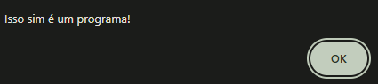
    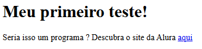
 

🧠 Conceitos abordados:

- O que é um programa

- Estrutura básica de um documento HTML

- Inserção de links e textos em HTML

- Utilização do alert() no JavaScript

- Introdução à interação com o usuário

🚀 Resultado:
Ao abrir o arquivo no navegador, o usuário vê uma página com um título, um parágrafo com link, e um alerta é exibido automaticamente dizendo: "Isso sim é um programa!"

---

## 📘 Módulo 02 – Escrevendo no Documento com JavaScript
Neste módulo, aprendemos a usar o método document.write() para escrever diretamente na página HTML usando JavaScript, além de realizar cálculos simples dentro das instruções.

📄 Saída esperada no navegador:

 

  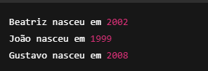
 

 🧠 Conceitos abordados:

- Inserção de conteúdo dinâmico com document.write()

- Concatenando texto com variáveis e expressões

- Operações matemáticas básicas em tempo real

- Uso do JavaScript para calcular o ano de nascimento

---

## 📘 Módulo 03 – Trabalhando com Variáveis e Cálculos
Neste módulo, aprofundamos o uso de variáveis no JavaScript para armazenar dados como nomes e idades. Utilizamos expressões matemáticas para calcular o ano de nascimento de cada pessoa e a média de idades, introduzindo também o uso de funções nativas como Math.round.

🧠 Conceitos abordados:
Declaração de variáveis com var

- Armazenamento de valores numéricos e de texto

- Reutilização de variáveis (ex: nome)

- Cálculos com variáveis

- Função Math.round() para arredondamento

- Escrita dinâmica com document.write()

🧾 Saída esperada:

 

  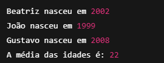
 

🔎 Observações: 
- A variável `ano` foi alterada no meio do código, demonstrando que valores podem ser modificados ao longo da execução.

- O uso de `Math.round()` ajuda a arredondar a média para o número inteiro mais próximo, tornando o resultado mais limpo.

---

## 📘 Módulo 04 – Criando Funções para Organizar o Código
Neste módulo, aprendemos a criar funções personalizadas para reutilizar comandos e deixar o código mais organizado e legível. Foi também reforçado o uso de operações matemáticas com variáveis e constantes.

🧠 Conceitos abordados:

- Criação de funções com `function`

- Reutilização de código com funções

- Separação de responsabilidades no código

- Encapsulamento de instruções (`document.write` e ` `)

- Cálculo de idade com base no ano atual

🧾 Saída esperada:

 

  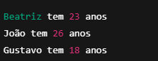
 

---

## 📘 Módulo 05 – Calculadora de IMC com Entrada de Dados
Neste módulo, desenvolvemos uma pequena calculadora de IMC (Índice de Massa Corporal), utilizando funções personalizadas, entrada de dados via `prompt()`, e estrutura condicional para analisar o resultado. Introduzimos também o conceito de retorno de valores com `return`.

🧠 Conceitos abordados:

- Funções com parâmetros e retorno (`calcularImc`)

- Entrada de dados com `prompt()`

- Conversão de string para número (`Number()`)

- Estruturas condicionais (`if`)

- Encapsulamento e reutilização de código

- Lógica básica de comparação

🧾 Saída esperada:

 

  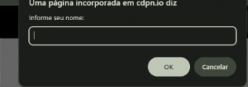
 

🧪 Exemplo de uso:

 Usuário informa:

 1️⃣ Nome: **Victor**

 2️⃣ Peso: **70**

 3️⃣ Altura: **1.62**

📌 Observações:

- O uso de `Number()` é importante, pois `prompt()` retorna texto.

- A função `calcularImc()` mostra como reutilizar lógica com entrada personalizada.

- O programa é interativo e adaptável a qualquer usuário, o que o torna mais prático e realista.

## ✅ Módulo 06 – Calculadora de Pontuação no Campeonato
Neste módulo, o objetivo foi criar um sistema que calcula a pontuação de um time com base nas vitórias e empates, e compara com a pontuação do ano anterior.

🧠 Conceitos abordados:

- Entrada de dados com `prompt()`

- Conversão para número inteiro com `parseInt()`

- Cálculo de pontuação com operadores matemáticos

- Condicionais para comparação `(if)`

- Funções reutilizáveis para exibição de mensagens

🧾 Saída esperada:

  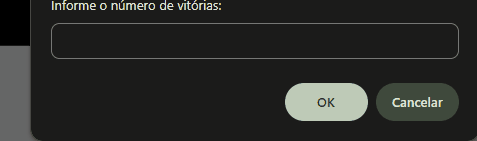
 

🧪 Exemplo de uso:
Usuário informa:

= Vitórias: 10

- Empates: 3

   → Pontos: 10×3 + 3 = 33

---

## ✅ Módulo 07 - Exercício 00: Adivinhe o Número
Este exercício simula um jogo simples em que o programa pensa em um número aleatório entre 0 e 10, e o usuário tenta adivinhar.

🧠 Conceitos abordados:

- Geração de números aleatórios com `Math.random()` e `Math.round()`

- Conversão de string para número com `parseInt()`

- Condicional `if / else`

- Funções personalizadas para organização do código

🧾 Saída esperada:

 

  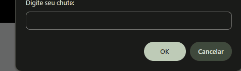
 

🧪 Exemplo de uso:

- Usuário digita: 7
- Número pensado aleatoriamente: 7

   → Resultado: Você Acertou!

## ✅ Módulo 07 - Exercício 01: Anos de Copa
Este exercício lista todos os anos em que houve Copa do Mundo, de 1930 até 2025, assumindo que a competição ocorre a cada 4 anos.

🧠 Conceitos abordados:

- Laço de repetição `for`

- Inicialização, condição e incremento no `for`

- Organização do código com funções auxiliares

🧾 Saída esperada:

 

  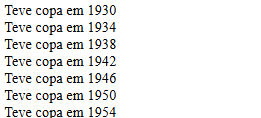
 

📌 Observação:

Este exercício não considera as Copas que foram canceladas por causa da Segunda Guerra Mundial (1942 e 1946), pois o foco aqui é a estrutura do laço e o raciocínio lógico, não a precisão histórica.

## ✅ Módulo 07 - Exercício 02: Soma das Idades dos Familiares
Neste exercício, o usuário informa quantos familiares deseja registrar e, em seguida, digita a idade de cada um. O sistema calcula a soma total dessas idades.

🧠 Conceitos abordados:

- Laço de repetição `while`

- Contador manual

- Acumulador de valores

- Entrada de dados com `prompt()`

- Conversão de strings com `parseInt()`

🧾 Saída esperada:

  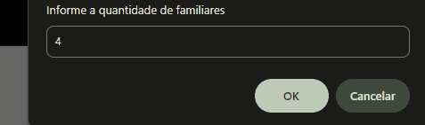
 

🧪 Exemplo de uso:

- Quantidade de familiares: 4

- Idades digitadas: 3, 4, 5, 6

   → Resultado: 18

## ✅ Módulo 07 - Exercício 03: Adivinhe o Número (com Tentativas)
Neste exercício, o usuário deve adivinhar um número aleatório entre 0 e 10. Ele tem até 3 tentativas para acertar. O jogo termina quando o número for descoberto ou as tentativas se esgotarem.

🧠 Conceitos abordados:

- Geração de número aleatório com Math.random()

- Conversão de entrada com `parseInt()`

- Laço `while` com contador de tentativas

- Estrutura de controle `if / else` com `break`

- Funções para exibição e quebra de linha

🧾 Saída esperada:

  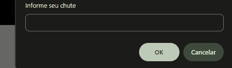
 

🧪 Exemplo de uso:

- Número secreto: 7

- Tentativas:

- 1ª: 1 → "Você Errou!"

- 2ª: 2 → "Você Errou!"

- 3ª: 3 → "Você Acertou!"

---

## ✅ Módulo 08 - Jogo com Campo de Entrada e Botão
Este exercício implementa o jogo de adivinhação com interface de usuário, usando elementos HTML (`input` e `button`) e eventos em JavaScript.

🧠 Conceitos abordados:

- Manipulação do DOM com `document.querySelector`

- Eventos com `onclick`

- Foco e limpeza de campos com `.focus()` e `.value`

- Geração de números aleatórios com `Math.random()`

- Comparação de valores de campos de formulário

🧾 Saída esperada:

  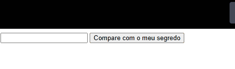
 

🧪 Exemplo de uso:

- Número secreto: 6

- 1ª: 1 → "Você Errou!"

- 2ª: 3 → "Você Errou!"

- 3ª: 6 → "Você Acertou!"

---

## ✅ Módulo  09 - Jogo de Adivinhação com Múltiplos Números
Neste móduloi, criaremos um jogo onde o usuário deve tentar acertar um número secreto, mas com uma diferença: **existem 10 números secretos!**

O sistema sorteia 10 números diferentes entre 1 e 10 (excluindo o zero), e o usuário tenta adivinhar se o número digitado está entre eles.

🧠 Conceitos abordados:

- Funções
- Laços de repetição (`while`, `for`)
- Condicionais (`if/else`)
- Arrays
- Manipulação do DOM (`querySelector`, `onclick`)
- Função `Math.random()` e `Math.round()`

🧾 Saída esperada:

  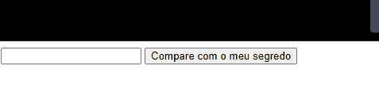
 
